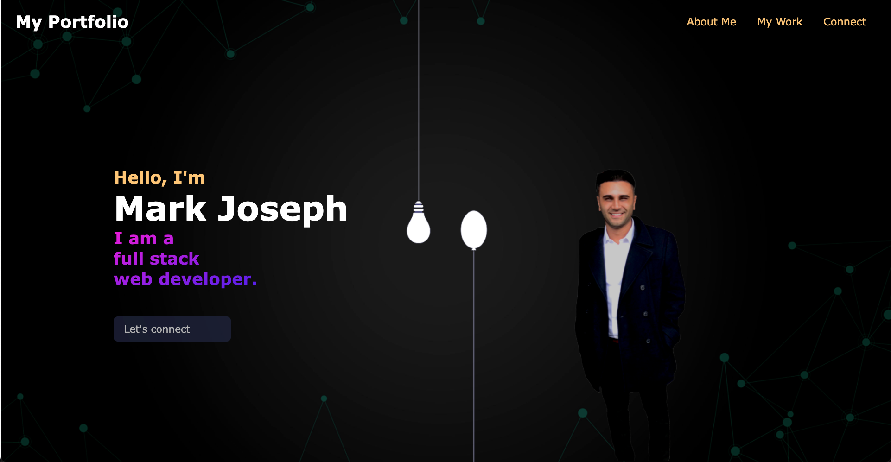

# Mark Joseph Porfolio Page

## Description

[Git Page - Deployed App](https://mjos7.github.io/my-react-portfolio)

Welcome to my portfolio page. Here you will find the following:

- Profile picture of me
- Brief description of my focus
- "About Me" section with a few paragraphs about my background
- "My Skills" section that list some of my development skills
- "My Work" section that has links to my portfolio. There are a few placeholders here that will be filled in as more projects are complete.
- Finally, in the "Let's Connect" section, I've provided a few different ways to connect with me including, Linkedin, Github, and email.

## Table of Contents

- [Links](#links)
- [Installation](#installation)
- [Tech Used](#tech-used)
- [Questions](#questions)
- [License](#license)

## Links

- [GitHub Repo](https://github.com/mjos7/my-react-portfolio)
- [Git Page](https://mjos7.github.io/my-react-portfolio)

## Installation

- None needed

## Tech Used

- React
- Javascript
- CSS
- JSX

## Questions

Please don't hesitate to reach out if you have any suggestions or feedback

## License

This app is licensed under the MIT license.
